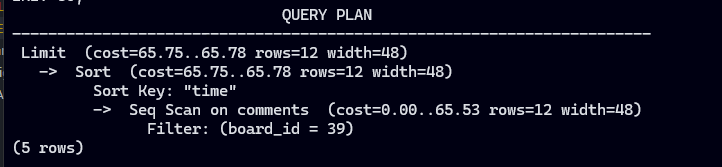
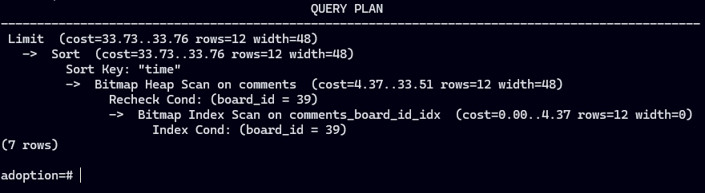

# SQL

SQL is a standard language for storing, manipulating and retrieving data in databases.

## PostgreSQL

PostgreSQL is a powerful, open source object-relational database system. And it is the most database used by javascript developers.

### Installation

```bash
docker run --name my-postgres -e POSTGRES_PASSWORD=mysecretpassword -p 5432:5432 -d --rm postgres:13.0
```

### Connect to PostgreSQL

```bash
docker exec -it -u postgres my-postgres psql
```

### PostgreSQL Shell Commands

```sql
\l -- List all databases
\c database_name -- Connect to a database
\dt -- List all tables
\d -- List all tables 
\d table_name -- Describe a table
\? -- List all commands available in the shell
\h -- List all SQL commands can be used in the shell 
```

### Create a Database

```sql
CREATE DATABASE message_boards; -- Create a database called message_boards
```

### Create a Table

```sql
CREATE TABLE users (
    user_id INTEGER PRIMARY KEY GENERATED ALWAYS AS IDENTITY,
    username VARCHAR ( 25 ) UNIQUE NOT NULL, 
    email VARCHAR ( 50 ) UNIQUE NOT NULL,
    full_name VARCHAR ( 100 ) NOT NULL,
    last_login TIMESTAMP,
    created_on TIMESTAMP NOT NULL
);
-- Create a table called users with the following columns
--- user_id: an integer column that is the primary key and auto-incremented
--- username: a string column that is unique and not null
--- email: a string column that is unique and not null
--- full_name: a string column that is not null
--- last_login: a timestamp column for recording the last login time
--- created_on: a timestamp column that is not null


INSERT INTO users (username, email, full_name, created_on) 
VALUES ('shebl74', 'mohamedshebla@gmail.com', 'Mohamed Shebl', now());
-- insert new raw into the users table

SELECT * FROM users;
-- select everything from the users table 
```

### Query Data in PostgreSQL

> First copy all sql commands from [data](./sample-postgresql.sql) file and paste it in the terminal to create the tables and insert data.

#### Select

```sql
SELECT * FROM users;
-- select all columns from the users table

SELECT username, email FROM users;
-- select only the username and email columns from the users table
```

#### Limit

```sql
SELECT * FROM users LIMIT 2;
-- select only the first 2 rows from the users table
```

#### Where

```sql
SELECT * FROM users WHERE user_id = 500;
-- select all columns from the users table where the user_id is 500

SELECT username, email, full_name FROM users 
WHERE last_login IS NULL LIMIT 10;
-- select the username, email, and full_name columns from the users table 
-- where the last_login is null and limit the result to 10 rows

SELECT user_id, username, email, created_on, last_login FROM users 
WHERE last_login IS NULL AND created_on < now() - interval '6 months' LIMIT 10;
-- select the user_id, username, email, created_on, and last_login columns from the users table 
-- where user never logged in and created the account more than 6 months ago and limit the result to 10 rows
```

#### Order By

```sql
SELECT user_id, email, created_on FROM users 
ORDER BY created_on LIMIT 10;
-- select the user_id, email, and created_on columns from the users table 
-- and order the result by the created_on column and limit the result to 10 rows

SELECT user_id, email, created_on FROM users 
ORDER BY created_on DESC LIMIT 10;
-- select the user_id, email, and created_on columns from the users table 
-- and order the result by the created_on column in descending order and limit the result to 10 rows

SELECT user_id, email, created_on FROM users 
ORDER BY created_on ASC LIMIT 10;
-- select the user_id, email, and created_on columns from the users table 
-- and order the result by the created_on column in ascending order and limit the result to 10 rows
```

#### Count

```sql
SELECT COUNT(*) FROM users;
-- count the number of rows in the users table

SELECT count(last_login) FROM users;
-- count the number of rows in the users table where the user logged in before
```

#### Update Data in PostgreSQL

```sql
UPDATE users SET last_login = now() WHERE user_id = 1 RETURNING *;
-- update the last_login column for the user 
-- with user_id 1 to the current timestamp (now) and return the updated row
```

#### Delete Data in PostgreSQL

```sql
DELETE FROM users WHERE user_id = 100 RETURNING *;
-- delete the user with user_id 100 and return the deleted row
```

### Foreign Keys

Foreign keys are used to link two tables together. A foreign key is a column or a group of columns in a table that reference the primary key of another table.

Recap our tables:

```sql
CREATE TABLE users (
  user_id INTEGER PRIMARY KEY GENERATED ALWAYS AS IDENTITY,
  username VARCHAR ( 25 ) UNIQUE NOT NULL,
  email VARCHAR ( 50 ) UNIQUE NOT NULL,
  full_name VARCHAR ( 100 ) NOT NULL,
  last_login TIMESTAMP,
  created_on TIMESTAMP NOT NULL
);

CREATE TABLE boards (
  board_id INTEGER PRIMARY KEY GENERATED ALWAYS AS IDENTITY,
  board_name VARCHAR ( 50 ) UNIQUE NOT NULL,
  board_description TEXT NOT NULL
);

CREATE TABLE comments (
  comment_id INTEGER PRIMARY KEY GENERATED ALWAYS AS IDENTITY,
  user_id INT REFERENCES users(user_id) ON DELETE CASCADE,
  board_id INT REFERENCES boards(board_id) ON DELETE CASCADE,
  comment TEXT NOT NULL,
  time TIMESTAMP
);
-- user_id and board_id are foreign keys that reference the user_id and board_id columns in the users and boards tables respectively
-- ON DELETE CASCADE means if a user or a board is deleted, all comments related to this user or board will be deleted


CREATE TABLE rich_content (
  content_id INTEGER PRIMARY KEY GENERATED ALWAYS AS IDENTITY,
  comment_id INT REFERENCES comments(comment_id) ON DELETE CASCADE,
  content JSONB NOT NULL
);
-- comment_id is a foreign key that references the comment_id column in the comments table
```

### Join Tables

Join tables are used to combine rows from two or more tables based on a related column between them. There are different types of joins in SQL: INNER JOIN, LEFT JOIN, RIGHT JOIN, and FULL JOIN.

**INNER JOIN** returns rows when there is at least one match in both tables.
**LEFT JOIN** returns all rows from the left table and the matched rows from the right table.
**RIGHT JOIN** returns all rows from the right table and the matched rows from the left table.
**FULL JOIN** returns rows when there is a match in one of the tables.

```sql
-- recap our knowledge 
SELECT comment_id, user_id, LEFT(comment, 20) AS preview 
from comments WHERE board_id = 39;
-- select the comment_id, user_id, 
--and the first 20 characters of the comment column as preview.
-- *LEFT* is a function that returns the leftmost characters of a string
-- *AS* is used to rename the column in the result. (alias)

------------ INNER JOIN ------------
SELECT comment_id, comments.user_id, users.username, LEFT(comment, 20) 
FROM comments INNER JOIN users ON comments.user_id = users.user_id 
WHERE board_id = 39;
-- select the comment_id, user_id from comments table, username from users table,
-- and the first 20 characters of the comment column as preview
-- from the comments table and the users table 
-- where the user_id in the comments table is equal to the user_id in the users table
-- and the board_id is 39
```

### SubQueries

SubQueries are queries that are nested inside another query. SubQueries can be used in SELECT, INSERT, UPDATE, and DELETE statements.

```sql
SELECT comment_id, user_id, LEFT(comment, 20) FROM comments 
WHERE user_id = (SELECT user_id FROM users WHERE full_name = 'Maynord Simonich');
-- get the comment_id, user_id, and the first 20 characters of the comment column
-- from the comments table 
-- when the user_id is equal to the user_id of the user with full_name 'Maynord Simonich'
```

### Group By

Group By is used to group rows that have the same values into summary rows. It is often used with aggregate functions like COUNT, SUM, AVG, MAX, and MIN.

```sql
SELECT boards.board_name, COUNT(*) AS comment_count 
FROM comments NATURAL INNER JOIN boards 
GROUP BY boards.board_name 
ORDER BY comment_count DESC LIMIT 10;
-- get the board_name and the number of comments for each board
-- by joining the comments and boards tables 
-- and grouping the result by the board_name
-- and ordering the result by the comment_count in descending order 
-- and limiting the result to 10 rows
-- **NATURAL INNER JOIN** is used to join two tables based on the columns with the same name
```

That can case an error if board has no comments, so we can use LEFT JOIN instead of INNER JOIN. or count the comment_id instead of using count(*).

```sql
SELECT boards.board_name, COUNT(*) AS comment_count 
FROM comments LEFT JOIN boards ON comments.board_id = boards.board_id 
GROUP BY boards.board_name 
ORDER BY comment_count DESC LIMIT 10;

SELECT boards.board_name, COUNT(comment_id) AS comment_count
FROM comments LEFT JOIN boards ON comments.board_id = boards.board_id
GROUP BY boards.board_name
ORDER BY comment_count DESC LIMIT 10;
```

### Json in PostgreSQL

```sql
CREATE TABLE rich_content (
  content_id INTEGER PRIMARY KEY GENERATED ALWAYS AS IDENTITY,
  comment_id INT REFERENCES comments(comment_id) ON DELETE CASCADE,
  content JSON NOT NULL
  -- content **json** type is used to store JSON data in the column
);
```

```sql
CREATE TABLE rich_content (
  content_id INTEGER PRIMARY KEY GENERATED ALWAYS AS IDENTITY,
  comment_id INT REFERENCES comments(comment_id) ON DELETE CASCADE,
  content JSONB NOT NULL
  -- content **jsonb** is binary JSON that is more efficient than JSON
);
```

```sql
SELECT content -> 'type' AS content_type FROM rich_content;
-- get the value of the type key 
-- and alias it as content_type from the content column in the rich_content table
```

```sql
SELECT DISTINCT content -> 'type' from rich_content;
-- get the distinct values of the type key from the content column in the rich_content table

-- or
SELECT DISTINCT CAST(content -> 'type' AS TEXT) FROM rich_content;
-- cast the value of the type key to text and get the distinct values

-- or
SELECT DISTINCT content ->> 'type' from rich_content;
-- **->>** is used to get the value of the key as text
```

```sql
SELECT content -> 'dimensions' ->> 'height' AS height, content -> 'dimensions' ->> 'width' AS width FROM rich_content WHERE content -> 'dimensions' IS NOT NULL;
-- get the height and width values from the dimensions object in the content column
-- when the dimensions object is not null
```

### Indexes in PostgreSQL

Indexes are used to speed up the retrieval of rows from a table. Indexes are created on columns in a table. There are different types of indexes in PostgreSQL: B-tree, Hash, GiST, SP-GiST, GIN, and BRIN.

```sql
EXPLAIN SELECT comment_id, user_id, time, LEFT(comment, 20) 
FROM comments WHERE board_id = 39 ORDER BY time LIMIT 50;
-- get the execution plan of the query to select the comment_id, user_id, time, and the first 20 characters of the comment column
```

- **output**



- **Create Index**

```sql
CREATE INDEX ON comments (board_id);
-- create an index on the board_id column in the comments table
```

- **output**



now the query will be see the cost of the query is reduced.

```sql
CREATE UNIQUE INDEX username_indx ON users(username);
-- create a unique index on the username column in the users table
```
